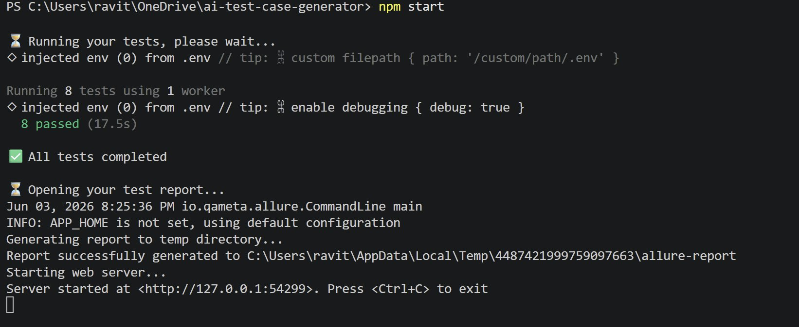
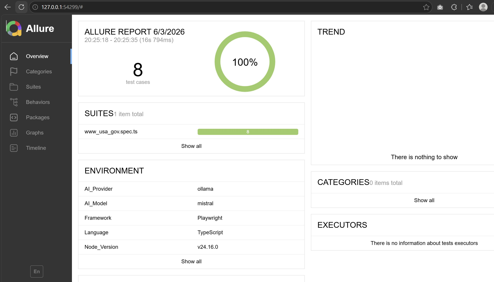
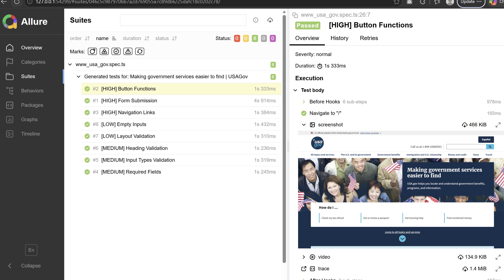

# AI Test Generator

A free, open-source tool that automatically generates and runs website tests using AI — no coding experience required.

Simply provide a website address, and the tool analyzes the page, generates comprehensive test cases, runs them, and produces a detailed report — all in one command.

---

## Why This Tool?

Manual test writing is time-consuming and requires technical expertise. This tool removes that barrier by letting AI do the heavy lifting — making quality testing accessible to everyone.

---

## What It Does

- Analyzes any website automatically
- Generates meaningful test cases using AI
- Runs the tests against the live website
- Produces a detailed visual report with pass/fail results

---

## Who Is It For?

- Non-technical users who want to test their website
- QA engineers looking to save time
- Developers who want instant test coverage
- Teams with no dedicated QA resources

---

## Getting Started

> ⚠️ **First time using this tool?**
> Complete the [one-time setup guide](PREREQUISITES.md) first.
> Takes approximately 15-20 minutes. Never needed again.

### Requirements

- [Node.js](https://nodejs.org) (version 18 or above)
- [Ollama](https://ollama.com/download) (free local AI — no API key needed)
- [Java](https://www.microsoft.com/openjdk) (for test reports)

### Installation

**1. Clone the repository**
```bash
git clone https://github.com/ravitejapioneerblaze-code/ai-test-case-generator.git
cd ai-test-case-generator
```

**2. Install dependencies**
```bash
npm install
npx playwright install chromium
```

**3. Set up local AI**
```bash
ollama pull mistral
```

**4. Configure environment**
```bash
cp .env.example .env
```

**5. Run the tool**
```bash
npm start
```

**6. Enter your website address when prompted**
That's it — the tool handles everything else automatically.

---

## What Happens Next

| Step | What the tool does |
|------|--------------------|
| 1 | Opens and analyzes your website |
| 2 | Generates test cases using AI |
| 3 | Runs all tests automatically |
| 4 | Opens a detailed test report |

---

## Supported AI Providers

The tool works with multiple AI providers. Configure your preferred option in the `.env` file:

| Provider | Cost | Setup |
|----------|------|-------|
| Ollama (default) | Free | Local, no account needed |
| Anthropic Claude | Paid | API key required |
| OpenAI GPT | Paid | API key required |

---

## Configuration

Copy `.env.example` to `.env` and set your preferences:

```env
# AI Provider: ollama, anthropic, or openai
AI_PROVIDER=ollama

# Ollama settings (free, local)
OLLAMA_MODEL=mistral

# Optional: only needed if using paid providers
ANTHROPIC_API_KEY=
ANTHROPIC_MODEL=claude-sonnet-4-5
OPENAI_API_KEY=
OPENAI_MODEL=gpt-4o-mini
```

---

## Sample Output

After running the tool, you will see a summary like this:

Website analysis complete
✅ Successfully created 8 test cases
📋 Here is a summary of your generated tests:

Form Submission with Valid Inputs — Priority: 🔴 High
Form Submission with Required Fields Empty — Priority: 🔴 High
Button Interaction Testing — Priority: 🔴 High
Navigation Testing — Priority: 🔴 High
Input Field Validation — Priority: 🟡 Medium
Heading Verification — Priority: 🟡 Medium
Layout Verification — Priority: 🟡 Medium
Edge Case Testing — Priority: 🟢 Low

✅ All tests completed

A full visual report opens automatically in your browser.


## Live Demo — Tested on a U.S. Federal Government Website

The following results were generated by running AI Test Generator 
against [usa.gov](https://www.usa.gov) — the official web portal 
of the United States government.

### Test Results


### Allure Report Overview


### Detailed Test Execution


> 8 AI-generated tests executed against usa.gov with 100% pass rate.
> Tests generated using free local AI — no API key required.

---

## Project Structure

ai-test-case-generator/
├── src/
│   ├── scraper.ts        # Website analysis
│   ├── analyzer.ts       # AI test generation
│   ├── generator.ts      # Test file creation
│   └── index.ts          # Main entry point
├── output/               # Generated test files
├── .env.example          # Configuration template
├── playwright.config.ts  # Test runner configuration
└── README.md

---

## Contributing

Contributions are welcome. Please open an issue or submit a pull request.

---

## License

MIT License — free to use, modify, and distribute.

---

## Author

Built by an experienced Senior QA Automation and AI engineer , as an open source contribution to make quality testing accessible to Federal Websites.